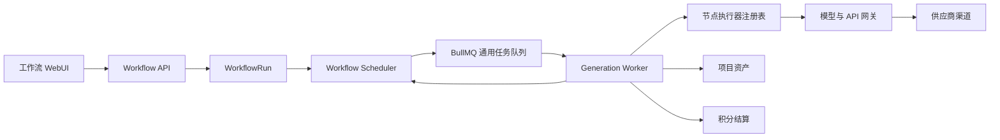
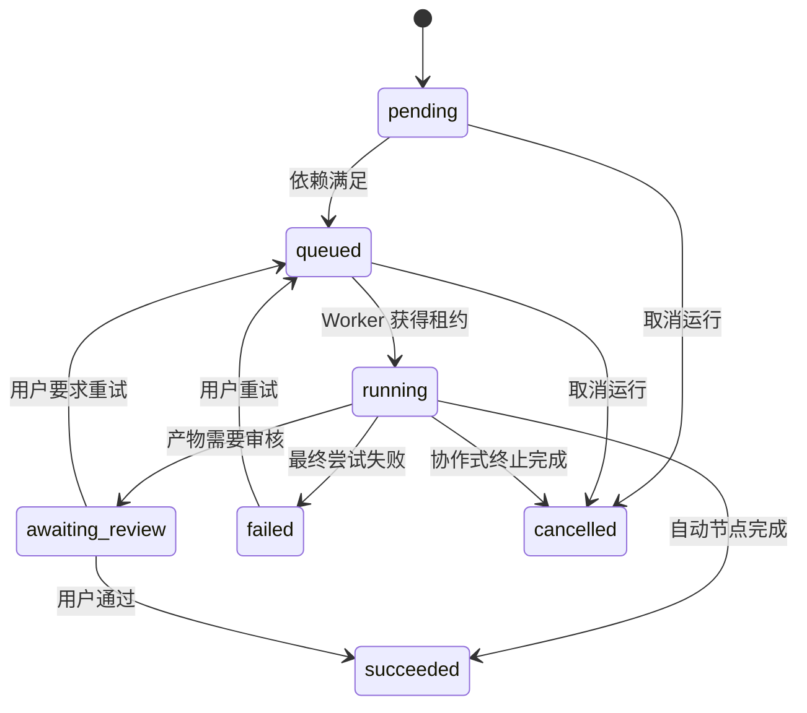

# Weavl 正式工作流运行时设计

## 1. 目标

工作流运行时负责把已经发布的流程定义转换为可恢复、可审核、可取消、可重试的节点任务。运行时与具体模型供应商解耦，后续接入视频、数字人、音频、文档或第三方 API 时，只增加节点执行器和模型渠道配置，不改变工作流调度主流程。

当前生产队列的全站执行并发为 10，单用户执行并发为 2。超过限制的任务保留在 BullMQ 中等待，不占用用户执行槽位，也不消耗额外重试次数。

## 2. 模块边界



- **Workflow API**：校验定义、输入、权限，创建运行，处理审核、取消与重试。
- **Workflow Scheduler**：计算依赖已经满足的节点，只投递可执行节点。
- **BullMQ**：保存等待、延迟与重试任务，不保存业务最终状态。
- **PostgreSQL**：工作流定义、运行、节点运行、生成任务、积分和资产的唯一事实来源。
- **Worker**：领取任务、执行节点、写入产物并触发下一轮调度。
- **节点执行器注册表**：按节点类型寻找执行器，使工作流核心不依赖视频、数字人等具体实现。
- **模型网关**：根据模型规格选择可用渠道，执行重试、熔断和请求日志记录。

## 3. 持久化模型

### WorkflowRun

表示用户发起的一次完整运行，保留已发布定义的不可变快照。

关键字段：

- `ownerId`：用户隔离与并发控制依据。
- `definitionSnapshot`：运行期间不受工作流后续编辑影响。
- `status`：`queued | running | awaiting_review | succeeded | failed | cancelling | cancelled`。
- `cancelRequestedAt`：用户发起取消的时间。
- `startedAt / completedAt`：统计运行耗时。

### WorkflowNodeRun

每个工作流节点对应一条持久化执行记录，是调度和恢复的最小业务单元。

关键字段：

- `runId / nodeId`：所属运行和定义节点。
- `kind`：`text | image | video | audio | avatar | document | api | transform`。
- `status`：`pending | queued | running | awaiting_review | succeeded | failed | cancelled`。
- `attempt`：业务重试版本，用户点击重试时递增。
- `queueJobId`：BullMQ 幂等键，建议为 `workflow_node_<nodeRunId>_<attempt>`。
- `generationJobId`：需要调用模型时关联统一生成任务。
- `inputSnapshot / outputSnapshot`：本次执行的解析后输入与结构化输出。
- `assetRefs`：阶段性产物和最终产物引用。
- `leaseToken / leaseExpiresAt`：节点执行抢占租约，防止多个 Worker 重复执行。
- `errorCode / errorMessage`：可分析、可重试的稳定错误信息。
- `startedAt / completedAt`：节点耗时统计。

### WorkflowNodeDependency

保存节点之间的有向依赖。节点只有在全部必需上游成功后才能入队。条件分支将命中的边标记为启用，未命中的分支节点标记为跳过。

## 4. 状态机



运行状态由节点状态归并得出：

- 存在 `awaiting_review`：运行进入 `awaiting_review`。
- 存在可执行或执行中的节点：运行保持 `running`。
- 全部终态且必需节点成功：运行进入 `succeeded`。
- 必需节点最终失败：运行进入 `failed`。
- 收到取消请求且活动节点全部停止：运行进入 `cancelled`。

## 5. 节点执行器契约

每种能力实现统一接口：

```ts
interface WorkflowNodeExecutor<TInput, TOutput> {
  readonly kind: WorkflowNodeKind;
  validate(config: unknown): void;
  estimate(input: TInput): Promise<GenerationQuote | null>;
  execute(context: WorkflowNodeContext<TInput>): Promise<WorkflowNodeResult<TOutput>>;
  cancel?(context: WorkflowNodeCancelContext): Promise<void>;
}
```

`WorkflowNodeResult` 只返回结构化输出和资产引用。执行器不能直接推进工作流；Worker 在数据库事务中确认当前租约仍有效后写入结果，再调用 Scheduler。

后续能力的接入方式：

| 能力         | 新增内容                                     | 不需要修改                   |
| ------------ | -------------------------------------------- | ---------------------------- |
| 视频         | `VideoWorkflowNodeExecutor`、模型及渠道参数  | 调度器、审核、资产、用户并发 |
| 数字人       | `AvatarWorkflowNodeExecutor`、角色与音色配置 | 调度器、队列、重试、积分流水 |
| PPT/Word/PDF | 文档执行器和渲染服务                         | 工作流状态机、权限与资产引用 |
| 第三方 API   | `ApiWorkflowNodeExecutor` 和凭证引用         | 节点依赖、取消、运行历史     |

## 6. 并发与公平调度

### 当前已实现

- Worker 全局并发：`WEAVL_GENERATION_WORKER_CONCURRENCY=10`。
- 单用户并发：`WEAVL_GENERATION_USER_CONCURRENCY=2`。
- 用户槽位使用 Redis 有序集合和 Lua 原子获取。
- 槽位使用租约并定时续期，Worker 异常退出后自动过期。
- 用户达到并发上限时，BullMQ 任务进入短延迟后重新排队，不消耗失败重试次数。
- 该限制跨进程、跨 Worker 副本生效。

### 正式工作流要求

- 一个工作流中的并行分支也计入该用户的 2 个槽位。
- 审核等待、队列等待和延迟任务不占执行槽位。
- 同一供应商应另设渠道级并发和 QPS，不能用用户并发代替供应商限流。
- 视频等长任务建议使用独立队列或保留并发配额，避免十个长视频阻塞轻量文本任务。
- 用户排队上限应按套餐配置，防止单个用户无限占用 Redis 和数据库。

## 7. 幂等、恢复和取消

- PostgreSQL 节点运行记录先于 BullMQ 入队创建。
- `queueJobId` 唯一，API 重试和 Worker 恢复不会重复添加同一尝试。
- Worker 必须通过条件更新获得节点租约，未获得租约不得调用供应商。
- 供应商支持幂等键时传递 `nodeRunId + attempt`。
- Worker 启动时扫描 `queued` 和租约已过期的 `running` 节点并重新入队。
- 任务完成后先固化对象存储，再在事务中写入资产引用、积分结算状态和节点结果。
- 取消运行时先写 `cancelRequestedAt`，删除尚未执行的队列任务；活动执行器通过 `AbortSignal` 或供应商取消接口协作停止。
- 无法中止的供应商调用完成后不得继续推进已取消运行，产物按策略保留或清理。

## 8. 积分规则

- 可预估的节点在入队前预扣积分。
- Token 计费节点先预扣最低额度，供应商返回实际用量后多退少补。
- 节点最终失败或在供应商调用前取消时退款。
- 用户主动取消但供应商已经产生费用时，根据供应商账单结算，避免平台承担已发生成本。
- 每个节点使用独立 `GenerationUsage`，工作流运行仅汇总，不直接修改余额。

## 9. API 与前端状态

建议增加：

- `POST /studio/workflows/:id/runs`：创建运行并返回节点状态。
- `GET /studio/workflows/runs/:runId`：获取运行、节点、资产和总体进度。
- `POST /studio/workflows/runs/:runId/cancel`：请求取消。
- `POST /studio/workflows/runs/:runId/nodes/:nodeRunId/retry`：重试单个节点及受影响下游。
- `POST /studio/workflows/runs/:runId/nodes/:nodeRunId/review`：通过、修改或退回审核节点。
- `GET /studio/workflows/runs/:runId/events`：SSE 推送状态变化；轮询作为降级方案。

前端只展示数据库状态，不根据请求是否返回推断任务完成。画布资产通过 `assetRefs` 引入，工作流产物不会自动加入全局资产。

## 10. 实施顺序

1. 当前通用队列启用全局 10、单用户 2 的并发限制。
2. 新增 `WorkflowNodeRun` 与依赖表，保留现有 JSON 字段用于迁移兼容。
3. 将现有同步 `advance()` 改成 Scheduler + 节点队列任务。
4. 先实现文本节点执行器和审核节点，验证恢复、取消、重试与积分。
5. 图片执行器复用现有 `ImageGenerationService`。
6. 视频、数字人、音频和文档按同一执行器契约接入。
7. 增加 SSE、队列位置、后台监控、渠道并发和告警。

## 11. 验收标准

- 20 个用户同时提交任务时，全站实际执行不超过 10，每个用户不超过 2。
- API、Worker 或服务器重启后，在途节点能从数据库恢复且不重复扣费。
- 同一节点重复入队只产生一份供应商调用和一组资产。
- 取消、失败、重试和审核均有完整状态与积分流水。
- 一个用户大量提交任务不会阻止其他用户获得执行槽位。
- 新增节点类型只需实现执行器并注册，不修改调度状态机。
